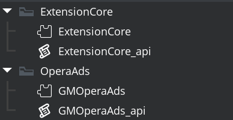

@title Setup

## Setting Up

Import the OperaAds extension folder with all subfolders into your project. Make sure to include the ExtensionCore subdirectory and all of its contents.



## Initialising the SDK

Before displaying ads, you must initialise the Opera Ads SDK. Configure your **Application ID** and **Placement IDs** in the extension options, then initialise early in your game (typically in the ${event.create} of your first room or game controller object):

```gml
// Initialize Opera Ads SDK
opera_ads_init(function(success, error_message)
{
    if (!success)
    {
        show_debug_message("Opera Ads init failed: " + string(error_message));
        return;
    }

    show_debug_message("Opera Ads initialised successfully!");
});
```

## Displaying Your First Ad

Once the SDK is initialised, you can load and display ads. Here's a simple example of showing a banner ad:

```gml
// Load a banner ad (uses placement ID from extension options)
opera_ads_banner_load(function(event, error_message)
{
    switch (event)
    {
        case OperaAdsCallbackEventBanner.Loaded:
            show_debug_message("Banner loaded");
            // Show banner at bottom center of screen
            opera_ads_banner_show(OperaAdsBannerPosition.BottomCenter);
            break;

        case OperaAdsCallbackEventBanner.Impression:
            show_debug_message("Banner impression recorded");
            break;

        case OperaAdsCallbackEventBanner.Clicked:
            show_debug_message("Banner clicked");
            break;

        case OperaAdsCallbackEventBanner.LoadFailed:
            show_debug_message("Banner load failed: " + string(error_message));
            break;
    }
});
```

## Using Custom Placement IDs

You can override the default placement IDs configured in the extension options:

```gml
// Set a custom banner placement ID before loading
opera_ads_banner_set_placement_id("your_custom_banner_id");
opera_ads_banner_load(function(event, error_message) { /* ... */ });
```

## Extension Configuration

Before using the extension, configure your Opera Ads credentials in the **Extension Options**:

1. Open the **GMOperaAds** extension in your project
2. Configure the following options:
   - **Android Application ID** - Your app ID from the Opera Ads publisher portal
   - **Android Interstitial** - Placement ID for interstitial ads
   - **Android Rewarded** - Placement ID for rewarded video ads
   - **Android Rewarded Interstitial** - Placement ID for rewarded interstitial ads
   - **Android App Open** - Placement ID for app open ads
   - **Android Banner** - Placement ID for banner ads
   - (Repeat for iOS with corresponding iOS placement IDs)

## Requirements

* **Android**: API 24+ (Android 7.0) minimum
* **iOS**: iOS 13+ minimum
* **Opera Ads Account**: Register at https://doc.adx.opera.com to obtain your Application ID and Placement IDs
* **ExtensionCore**: Must be imported alongside the OperaAds extension

GameMaker will automatically download the required SDK dependencies (via Gradle for Android and CocoaPods for iOS) during the build process.
